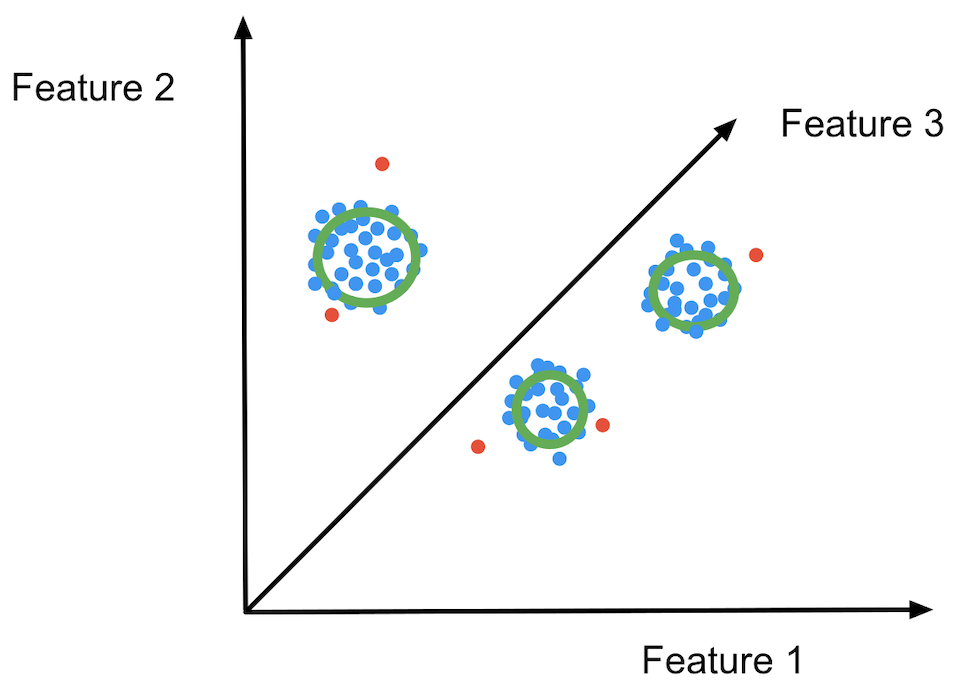
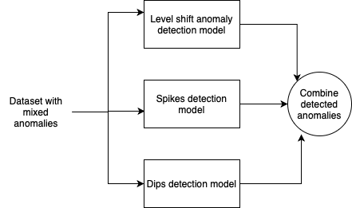

* The unsupervised approach that we tried on the Yahoo benchmark dataset is a k means based clustering approach.
* Brief description of the approach
    * The dataset was divided into training set and test set at 70:30 ratio. 
    * Normal data points of the training set 
    were allowed to be clustered based on features (features have been decided to perform anomaly detection). 
    Attack boundaries for each cluster was decided based on the 99th percentile of the distances from the datapoints in each
    cluster to its centroid. 
    * Point by point of the test set (transformed to features) was sent to the cluster space. Theoretically, 
    if features we have determined distinctly classify anomaly points and non-anomaly points correctly, a new anomalous 
    data point should be allocated to a cluster, but the distance from the cluster centroid to the data point will be
    greater than the attack boundary distance from the centroid. 
    * The following image shows the cluster space for 3 features. Non anomalous data points are shown in blue, while 
    attack boundary is shown in green and red points are the anomalous points (coming from the test dataset).
     
 
* Features were determined to detect each type of anomaly (spikes, dips and level shifts). Therefore, types of 
anomalies are detected separately and combined before returning the final list of anomaly points. 

* Description of files (Note: all the output figures are saved in visualizationFigures directory)
    * visualizeFullDataset.py - is used to draw all datasets belonging to a particular type of anomaly side by side. Seperation points and anomaly points are marked. Output directory : fullDatasetVisualizationDirectory
    * plotFeatureUnderneath.py - is used to draw a required feature plot below the original timeseries. This is useful when visually determining important features. Output directory : featurePlots
    * clusterPlotting.py - is useful to plot pair-wise features and determine how clusters are formed. Output directory : clusterPlots
    * featureDeterminationForAnomalyTypes.py - is useful to determine the best features (for each type of anomaly) out of the shortlisted features by drawing featurePlots. Detected anomaly points are marked as TP,FP,FN. Output directory : afterDetectionPlots
    * finalAnomalyDetectionSolution.py - is useful to evaluate the features determined by testing on mixed_anomaly and full_datasets. Detected anomaly points are marked as TP,FP,FN. Output directory : afterDetectionPlots
    * finalAnomalyDetectionSolutionWithFolds.py - is useful to evaluate the anomaly detection solution on stratified 5 folds. Output directory : foldsAfterDetectionPlots

